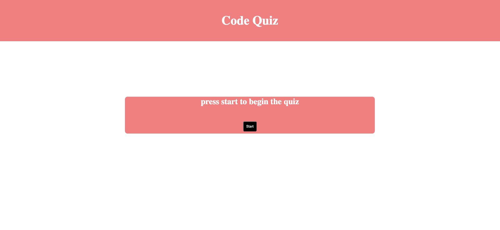

# Code Quiz
[https://jayladenae.github.io/Code-Quiz/](https://jayladenae.github.io/Code-Quiz/)

## Description 
A timed, 5 question code quiz using jQuery.

### User Story 
```
GIVEN I am taking a code quiz
WHEN I click the start button
THEN a timer starts and I am presented with a question
WHEN I answer a question
THEN I am presented with another question
WHEN I answer a question incorrectly
THEN time is subtracted from the clock
WHEN all questions are answered or the timer reaches 0
THEN the game is over
WHEN the game is over
THEN I can save my initials and my score
```

### License


